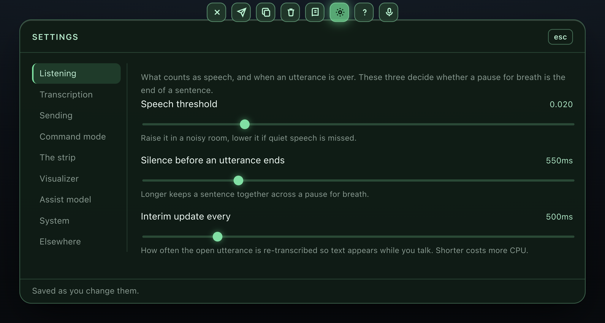
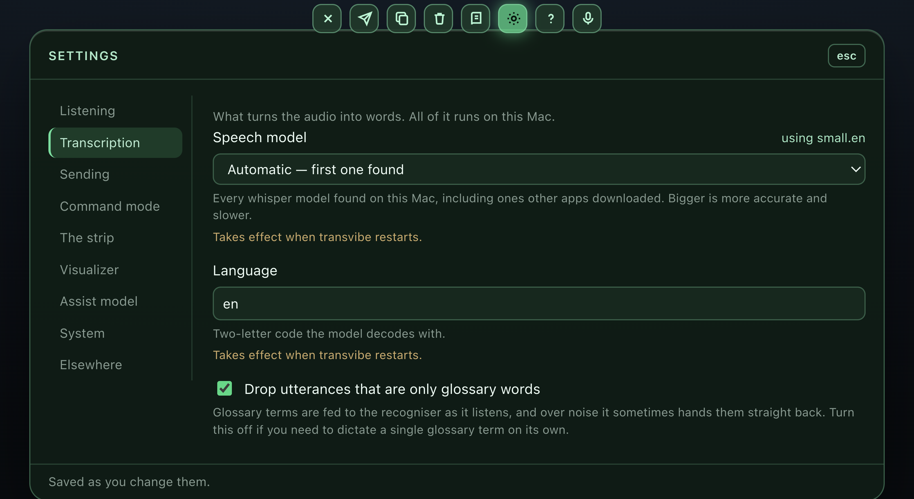

# Settings

The gear on the strip, or **Settings…** in the menu bar (⌘,). Tabs down the left, one section at a time; every change saves and takes hold as you make it, which is the point — the speech threshold and the fade delay are settings you tune by watching what they do, not by editing a file and relaunching.

Two exceptions say so on the row: the speech model and the language are baked into a running whisper server and take effect on restart.

Six tabs, grouped by what you are trying to change rather than by which part of the app does it: **Listening** (what it hears and what it throws away), **Agents** (who you talk to and how they answer), **Transcription** (what turns sound into text), **Sending**, **Visuals** (the strip and the ribbon), and **Advanced** (the plumbing). A long tab carries sub-headings rather than becoming a wall of sliders.

`vocabulary` and `corrections` are not in it: they have the glossary panel, which is a better editor for them than a text field, and the Transcription tab links there. `agents` is edited in the Agents tab, but as a list of records — a name, a kind, a voice and a model per row — rather than as fields. One setting in the panel is not in the file: **Launch at login** is macOS's, kept in its Login Items list.

Most of it is reachable by voice too — "hey Claude, turn off spoken replies", "set the fade to ten seconds", "what's the threshold". Everything in the table below is, except `agents`, `language`, `sendTarget`, `modelPath` and `assistUrl`: those are free text or paths, and a misheard wake phrase would take the voice commands with it. [Using transvibe](using.md#settings-by-voice) has the grammar.

Behind it is `~/Library/Application Support/transvibe/settings.json`, written on change and merged over the defaults, so deleting the file resets everything. Editing it by hand still works; the panel reads it fresh each time it opens.

| key | default | |
|---|---|---|
| `threshold` | `0.02` | RMS level that counts as speech |
| `hangoverMs` | `550` | silence before an utterance is considered finished |
| `interimMs` | `500` | how often the open utterance is re-transcribed |
| `commandTimeoutMs` | `6000` | command mode disarms itself after this |
| `conversationMs` | `25000` | how long an agent that talks back keeps listening without its name; `0` off |
| `agents` | one commands agent | who you can talk to: a name, what it does, the voice it says it in and the model it thinks with. Edited in the Agents tab |
| `wakeWordFuzzy` | `true` | forgive near-misses in the wake phrase ("hey cloud") |
| `speakReplies` | `true` | say what a command just did, out loud |
| `speakVoice` | `null` | macOS voice name for agents that have none of their own; null = the system voice |
| `speakRate` | `0` | words per minute; `0` = the voice's own pace |
| `sendTarget` | `null` | app to focus before pasting; null = whatever is in front |
| `sendPressesEnter` | `false` | also hit Return after pasting |
| `clearAfterSend` | `true` | empty the transcript once delivered |
| `stripHeight` | `180` | minimum height of the strip; it grows to fit |
| `panelHeight` | `560` | height while the help or glossary panel is open |
| `wakeDelayMs` | `320` | pointer dwell before the strip stops being click-through |
| `idleFadeMs` | `6000` | silence before the transcript fades |
| `idleClearMs` | `20000` | silence before it is forgotten entirely; `0` never |
| `alwaysOnTop` | `true` | keep above other windows |
| `autoCopy` | `false` | copy every finished utterance automatically |
| `modelPath` | `null` | pin a specific ggml model |
| `language` | `'en'` | recognition language |
| `vocabulary` | `[]` | terms to bias recognition toward |
| `corrections` | `{}` | wrong → right rewrites applied to finished text |
| `confidenceFloor` | `-0.5` | ignore an utterance the recogniser was less sure of than this; `0` off |
| `dropGlossaryEcho` | `true` | discard an utterance that is only glossary words |
| `cleanup` | `false` | tidy fillers out of settled text with the assist model |
| `commandFallback` | `false` | ask the assist model about unrecognised commands |
| `assistUrl` | `'http://127.0.0.1:11434'` | where Ollama is listening |
| `vizLinesPerFamily` | `18` | polylines per hue family (×3) |
| `vizPoints` | `220` | samples per polyline |
| `vizFps` | `30` | frame rate while speech is detected |
| `vizQuietFps` | `8` | frame rate in a silent room |
