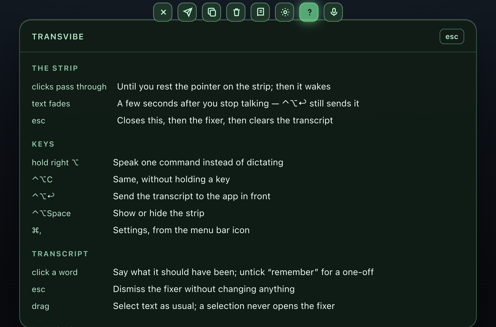
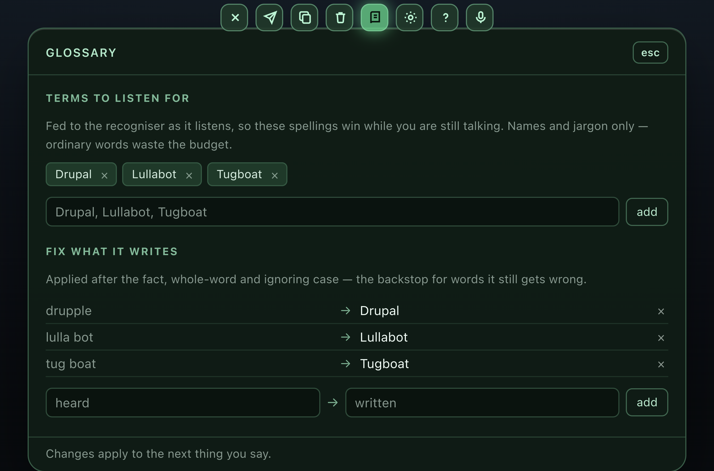

# Using transvibe

The day-to-day reference. [Run instructions are in the README](../README.md).

## The strip

There is no window to move, focus, or close. The app is a transparent band hanging from the top of the screen, above everything including full-screen apps, and **click-through** — every click goes to whatever is behind it.


The ribbon along the top edge is the audio itself — three families of lines over a slowly drifting hue, additively blended so they bloom where they cross. It is flat and dim in a silent room and travels with whatever it hears, which is the fastest way to tell that the microphone is working without saying anything to find out.


**Rest the pointer on it and it wakes**: the words become clickable and the buttons appear. Move away and it is a ghost again. Waking takes a deliberate dwell, so sweeping up to the menu bar never steals a click, and only the text, the buttons and the panels count — a click in the empty air between them reaches the app underneath even while the pointer is on the strip.

**The text fades.** Six seconds after the last thing you said, the transcript fades out. It is still there to send with ⌃⌥↩, but it is now stale: the next thing you say starts a fresh transcript rather than appending to something you can no longer see. Speaking, or reaching for the strip, brings it back. `esc` clears it outright.

**And then it is forgotten.** Twenty seconds after it fades, a transcript nobody has come back to is thrown away — the text, and the undo history with it. The mic hears the whole room, and music, a podcast, or someone stopping by to ask you something all get transcribed the same as dictation; none of it should still be sitting on the strip an hour later waiting for a ⌃⌥↩ meant for something else. Speaking again, or resting the pointer on the strip, restarts the clock. Settings › The strip sets the delay, or drags it all the way left to keep the text until you clear it yourself.

The strip grows to fit what it is showing, and the transcript itself caps at four lines — older text scrolls off the top.

## Controls

The controls only exist while the strip is awake. They sit in a row directly under the transcript, not off in a corner: hovering the text is what woke the strip, so the pointer is already there.

| | |
|---|---|
| Close (×) | Clear the transcript and get out of the way |
| Copy | Copy the full transcript |
| Clear | Empty the transcript |
| ➤ | Send the transcript to the frontmost app |
| Click a word | Correct it, optionally saving the fix to the glossary |
| Book | Glossary — terms to recognise, and fixes for the ones it misses |
| Gear | [Settings](settings.md) — everything else, applied as you change it |
| ? | In-app help — keys, buttons, and the full command list |
| hovering any button | Describes it on the status line under the row |
| Pause | Stop feeding segments to the recogniser |
| `esc` | Closes the fixer, then a panel, then clears the transcript |
| `⌃⌥Space` | Show/hide the strip from anywhere |
| Hold right `⌥` | Speak one command instead of dictating |
| `⌃⌥C` | Same, without holding a key |
| `⌃⌥↩` | Send the transcript to the app in front |

## Command mode

By default everything you say is transcribed. **Hold the right ⌥ key** and the strip swings amber — speak one editing command, release, and it drops straight back to transcribing. (**⌃⌥C** does the same thing without the hold, for when the key is awkward.) If you say nothing it disarms itself after 6 seconds.

    "open settings"                "close the panel"
    "capitalize that"              "delete the last three words"
    "uppercase that"               "delete that" / "scratch that"
    "lowercase that"               "undo that" / "never mind"
    "new paragraph"                "replace whisper with Whisper"
    "question mark"                "copy that" / "clear everything"
    "send that" / "ship it"

### Two in one breath

Commands chain: **"open settings and change the voice to Karen"**, "copy that then clear everything", "delete the last word, then capitalize that". Joined with *and*, *then*, *and then* or a comma, up to four in a sentence, run left to right, with one spoken confirmation at the end rather than one per part.

It is all or nothing. Every part has to parse as a real command before any of them runs, because "and" is a word that turns up inside commands as well as between them — half a chain executed on a misreading is worse than no chain. The split is only tried after the whole sentence has failed to parse on its own, so "replace cat and dog with pets" is still one replace, and "set the rate to two hundred and fifty" is still one number.

Releasing the key does not end command mode on its own: the utterance is usually still open when your thumb comes up, and the recogniser needs its silence window to close it. Release just starts the idle timeout — the command is consumed when the utterance actually finishes.

Anything the rules cannot place is shown as `not a command: "…"` rather than guessed at, so nothing you said is silently swallowed. With [`commandFallback`](assist.md) on, that miss goes to the local assist model first, which makes phrasings like "nope, take that back" or "stick that on the clipboard for me" work without adding a rule for each one.

### The wake phrase

There is a third way in, with no key at all: **open the sentence with "hey Claude"** and the rest of it is the command.

    "hey Claude, delete the last three words"
    "hey Claude, replace whisper with Whisper"
    "hey Claude could you uppercase that"

This is the one that works while a transcript is already sitting on the strip, and while your hands are somewhere else. The strip swings amber as soon as the phrase is recognised in the open utterance — before you have finished the sentence — and shows the command without its keyword, which is exactly what the parser is about to be handed.

Said on its own, "hey Claude" just arms command mode for the next thing you say, the same as ⌃⌥C.

The phrase has to come first. A keyword recognised anywhere would turn "I told him hey Claude was down" into a command; recognised only at the front, after fillers like "um" and "so", it stays out of ordinary speech. Near misses are forgiven, because a small model hears an unusual name loosely — "hey cloud" and "hey claud" both count. Change the phrase, or turn either behaviour off, under Settings › Command mode.

Because the app decided this was a command rather than you, an utterance that reaches the parser and means nothing to it is **put back into the transcript** rather than dropped: `not a command — kept "…"`. The key path does not do that — there you meant a command, so being told is better than a stray sentence appearing.

### Settings, by voice

**"open settings"** brings the panel up — the strip is shown first if it was hidden, so it always opens onto something you can see — and **"close the panel"** puts it away, which is what esc does for hands that are on the keyboard.

The same sentence that edits the transcript can change the app. Say the setting's name and what you want done with it:

    "hey Claude, turn off spoken replies"      any on/off setting
    "hey Claude, set the fade to ten seconds"  any slider
    "hey Claude, raise the threshold"          a nudge either way
    "hey Claude, make the voice Karen"         any English voice on this Mac
    "hey Claude, what's the threshold"         ask instead of change

Sliders take the number however you say it — "zero point zero three", "0.03", "two hundred", "a thousand" — and are clamped to the range the panel allows, so "set the frame rate to a thousand" gets you 60 rather than an unusable app. A bare number on a setting measured in milliseconds is read as seconds, because "set the fade to ten" is how people say it and nobody wants a ten-millisecond fade. A nudge is a quarter of where the setting currently sits, rounded to a step the slider can land on.

One sentence is read two ways: "change voice to Karen" is also a valid *replace* — swap the word "voice" for the word "Karen". A sentence that names a setting is treated as being about that setting, and that preference applies only against replace; every other command shape is unambiguous. If you genuinely need to edit the word "voice" in the transcript, "replace voice with Karen" still does it.

The rules are generated from the settings panel itself, so the two can't drift apart, and the panel updates under you if it happens to be open. Twenty-five settings are reachable. The wake phrase, the language, the send target and the two model paths are not: they are free text, and a misheard wake phrase would take the voice commands with it. The `?` panel lists the names to say.

The verb and the setting's name have to be adjacent, which is what keeps this out of ordinary speech — "turn off the lights" names no setting and is transcribed as what it is. A settings change is not on the transcript's undo stack; undo it by saying the opposite.

### It answers out loud

A command you gave with your voice gets an answer in the same key: **"deleted the last three words"**, "copied", "not found". The point is the same one the wake phrase is making — while you are dictating you are looking at the app the words are going into, and a confirmation you have to look up at the strip to read is one you will not read.

The microphone stops listening for exactly as long as the reply takes, plus a fraction for the room's echo, so the app never transcribes itself. (Echo cancellation is on and is not enough on its own — the speakers are a foot from the mic, and an app that hears the wake phrase in its own confirmation is an app that talks to itself.) Nothing is lost while it is deaf: what you say next opens a fresh utterance.

The wording is the assist model's when [it is running](assist.md) — it shortens the strip's own line into something worth hearing — and the strip's line as written when it is not. Either way it is describing what already happened; the model is handed the outcome, so it cannot announce one that did not occur.

Turn it off, pick a voice, or set the speed under **Settings › Spoken replies** — changing the voice or the rate says one line back in it straight away, which is the only way to choose a voice. (That preview plays even with replies switched off: picking a voice is a question about the voice.) The list is the English voices this Mac has — the replies are written in English, so the other 140 are not offered. More install under System Settings › Accessibility › Spoken Content and show up without a restart; a non-English one can still be named by hand in `settings.json`.

The **?** button opens an in-app help panel with the full list (`esc` or `?` toggles it too). It is generated from the parser, so it cannot describe a command the parser does not have.



## Music in the room

A microphone that listens all the time hears the room, and a small Whisper model will happily turn a song into a sentence. Two things stop that, and neither of them touches the visualizer — the ribbon still dances to whatever is playing, because it is fed from the microphone directly rather than from the transcript.

**The recogniser's own confidence.** Whisper reports how sure it was, per utterance, and the gap is not subtle. Measured against this app's own server: real speech comes back at an average log probability of −0.01 to −0.08, while a chord, a fan and a pure tone land at −0.65, −0.76 and −0.64. Anything below **Settings › Transcription › Ignore anything less certain than** (−0.5 by default) is thrown away, and the strip says `ignored — not speech` so you can see it working while you tune it. All the way right turns the check off. (`no_speech_prob`, which sounds like the field for exactly this job, reads 0.0000 for music and is no use at all.)

**A noise floor that keeps learning.** The detector adapts to how loud the room is, but it used to do that only while the room was quiet — so music playing continuously read as speech forever, and the floor stayed frozen at whatever the room was when the track started. Now a level that has stayed up for twenty seconds without a single dip is treated as the room rather than as a sentence: nobody talks that long without a gap. The floor climbs, the music stops registering, and talking over it still works because speech has to clear the background by a margin rather than clear a fixed number.

## The glossary

Names, jargon and product words are what a small Whisper model gets wrong most consistently — it has never seen them, so it reaches for the nearest thing it has. Two lists attack that from opposite ends: **terms** are fed to the recogniser as it listens, so the spelling wins while you are still talking; **fixes** rewrite what it got wrong anyway.

**Click a word in the transcript** to say what it should have been. The rewrite always happens; what you keep is the opt-out. *Remember the fix* saves it as a rule, and *listen for it too* adds the corrected spelling to the terms — untick both and the word is simply fixed here and now, which is what a one-off mishearing deserves. Both checkboxes hold their setting for the rest of the session, so a run of throwaway fixes is one click, not one per word.


Esc, the *esc* button, or a click anywhere outside dismisses it without changing anything. Dragging still selects text; only a click that leaves no selection opens the fixer. The "heard" side stays editable, which is how a two-word phrase gets a rule.



The book button opens the glossary panel: terms on top, fixes below, added and removed in place. Every edit is written to the settings file and swapped into the running recogniser immediately — the model stays loaded, and the change takes effect on the next thing you say.

The same data lives in the settings file, if you would rather paste a list in:

```json
{
  "vocabulary": ["Drupal", "Lullabot", "Tugboat", "transvibe", "Claude Code"],
  "corrections": {
    "trans vibe": "transvibe",
    "drupple": "Drupal",
    "lolabot": "Lullabot"
  }
}
```

Keep the terms to words that actually get mangled — a long list of ordinary English is worse than a short one. [Why, and what a fix actually matches](architecture.md#the-glossary).

## Sending the transcript

Dictating into a HUD is only useful if the text can get where you actually want it. **⌃⌥↩** (or the ➤ button, or saying *"send that"*) pastes the transcript into whatever app is in front — no copy, switch, paste.

It pastes rather than typing the text out keystroke by keystroke: pasting is instant and cannot mangle characters the target app treats specially.

The subtle part is focus. If transvibe has focus, ⌘V would land in its own window, so it hides first — which returns macOS focus to whatever app you were in before. Triggered by the global shortcut it never had focus at all, and the target is already frontmost. Set `sendTarget` in settings to an app name (e.g. `"Warp"`) to always focus that app first regardless.

| setting | default | |
|---|---|---|
| `sendTarget` | `null` | app to focus before pasting; null means whatever is in front |
| `sendPressesEnter` | `false` | also hit Return after pasting |
| `clearAfterSend` | `true` | empty the transcript once it has been delivered |

This needs **Accessibility** permission to post the keystroke — a different grant from the Input Monitoring that the right-⌥ tap uses. Without it the text is still on the clipboard and the status line says so, so the fallback is the old copy-and-paste rather than nothing.

## Menu bar

transvibe lives in the macOS menu bar as a waveform icon. Left-click toggles the strip; right-click opens a menu with show/hide, a listening checkbox, copy and clear, the three panels (Settings ⌘,, Glossary, Keys & commands), Launch at login, Reveal model folder, and Quit.

The three panel entries show the strip on the way, since a panel opened onto a hidden window is nothing to look at.

Hiding parks the app in the menu bar with the model still resident, so bringing it back is instant rather than a fresh model load. It comes back without stealing focus from what you were typing in. Only Quit (or `⌘Q`) actually tears down the engine.
